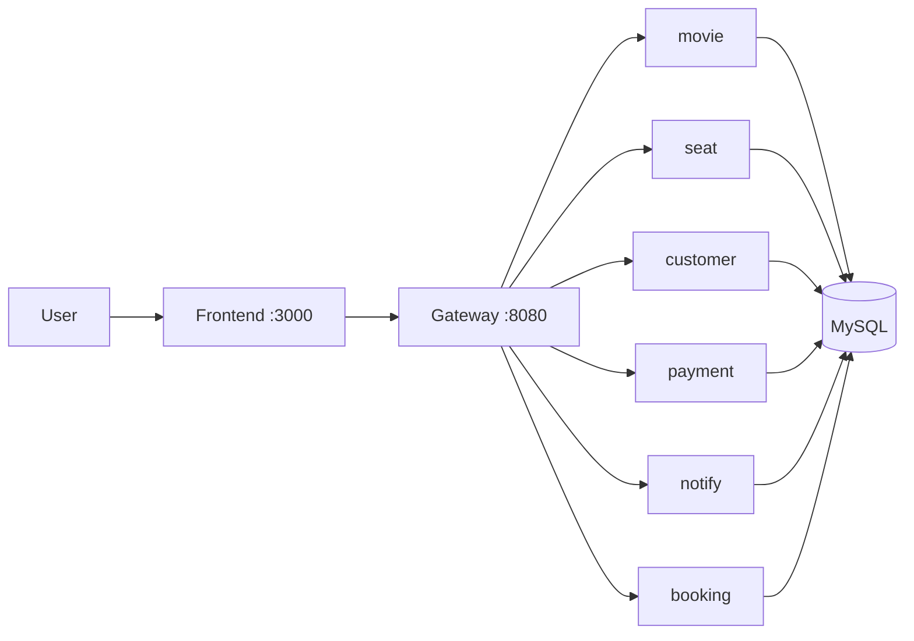

# Project Name

[](https://github.com/hungdn1701/microservices-assignment-starter/stargazers)
[](https://github.com/hungdn1701/microservices-assignment-starter/network/members)
[](LICENSE)

> Brief description of the business process being automated and the service-oriented solution.

> **New to this repo?** See [`GETTING_STARTED.md`](GETTING_STARTED.md) for setup instructions and workflow guide.

---

## Team Members

| Name | Student ID | Role | Contribution |
|------|------------|------|-------------|
|      |            |      |             |

---

## Business Process

*(Summarize the business process being automated — domain, actors, scope)*

---

## Architecture



| Component | Role | Port (host) |
|-----------|------|-------------|
| **movie-service** | Movies / cinemas / showtimes | 5001 |
| **seat-availability-service** | Seat map & holds | 5002 |
| **customer-service** | Customers & validation | 5003 |
| **payment-service** | Payments (mock gateway) | 5004 |
| **ticket-booking-service** | Checkout orchestration | 5005 |
| **notification-service** | Booking emails (mock) | 5006 |
| **gateway** | Spring Cloud Gateway | 8080 |
| **mysql** | Per-service DBs | 3306 |
| **frontend** | Static placeholder | 3000 |

> Full documentation: [`docs/architecture.md`](docs/architecture.md) · [`docs/analysis-and-design.md`](docs/analysis-and-design.md)

---

## Getting Started

```bash
# Clone and initialize
git clone <your-repo-url>
cd <project-folder>
cp .env.example .env

# Build and run
docker compose up --build
```

### Verify

```bash
curl -s http://localhost:8080/actuator/health
curl -s http://localhost:5001/health
curl -s http://localhost:5002/health
curl -s http://localhost:8080/movies
curl -s "http://localhost:8080/showtimes/1/seats"
```

---

## API Documentation

- [Movie Service](docs/api-specs/movie-service.yaml)
- [Seat Availability](docs/api-specs/seat-availability-service.yaml)
- [Customer](docs/api-specs/customer-service.yaml)
- [Payment](docs/api-specs/payment-service.yaml)
- [Notification](docs/api-specs/notification-service.yaml)
- [Ticket Booking](docs/api-specs/ticket-booking-service.yaml)

---

## License

This project uses the [MIT License](LICENSE).

> Template by [Hung Dang](https://github.com/hungdn1701) · [Template guide](GETTING_STARTED.md)

