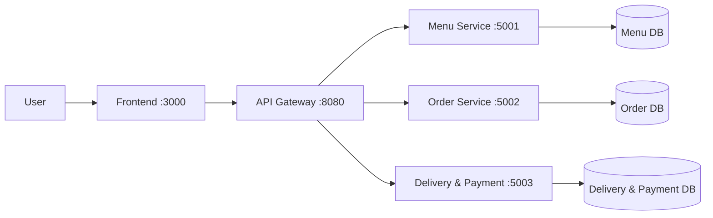

# Project Name

[](https://github.com/hungdn1701/microservices-assignment-starter/stargazers)
[](https://github.com/hungdn1701/microservices-assignment-starter/network/members)
[](LICENSE)

> Brief description of the business process being automated and the service-oriented solution.

> **New to this repo?** See [`GETTING_STARTED.md`](GETTING_STARTED.md) for setup instructions and workflow guide.

---

## Team Members

| Name | Student ID | Role | Contribution |
|------|------------|------|-------------|
| Ngô Tuấn Anh | B22DCCN024 |      |             |
| Đặng Quân Bảo | B22DCCN060 |      |             |
| Phạm Trung Kiên | B22DCCN432 |      |             |

---

## Business Process

*(Summarize the business process being automated — domain, actors, scope)*

---

## Architecture



| Component     | Responsibility | Tech Stack | Port |
|---------------|----------------|------------|------|
| **Frontend**  | UI for menu & orders | React, Vite, nginx | 3000 |
| **Gateway**   | Routing, CORS | Spring Cloud Gateway | 8080 |
| **Menu Service** | Menu & categories | Spring Boot, JPA, MySQL | 5001 |
| **Order Service** | Orders, totals, menu integration | Spring Boot, JPA, WebClient, MySQL | 5002 |
| **Delivery & Payment Service** | Mock payment & delivery | Spring Boot, JPA, MySQL | 5003 |

> Full documentation: [`docs/architecture.md`](docs/architecture.md) · [`docs/analysis-and-design.md`](docs/analysis-and-design.md)

---

## Getting Started

```bash
# Clone and initialize
git clone <your-repo-url>
cd <project-folder>
cp .env.example .env

# Build and run
docker compose up --build
```

### Verify

```bash
curl http://localhost:8080/health   # Gateway
curl http://localhost:8080/menu/foods   # Menu via gateway
curl http://localhost:5001/health   # Menu Service
curl http://localhost:5002/health   # Order Service
curl http://localhost:5003/health   # Delivery & Payment Service
```

---

## API Documentation

- [Menu Service — OpenAPI Spec](docs/api-specs/menu-service.yaml)
- [Order Service — OpenAPI Spec](docs/api-specs/order-service.yaml)
- [Delivery & Payment Service — OpenAPI Spec](docs/api-specs/delivery-payment-service.yaml)

---

## License

This project uses the [MIT License](LICENSE).

> Template by [Hung Dang](https://github.com/hungdn1701) · [Template guide](GETTING_STARTED.md)

