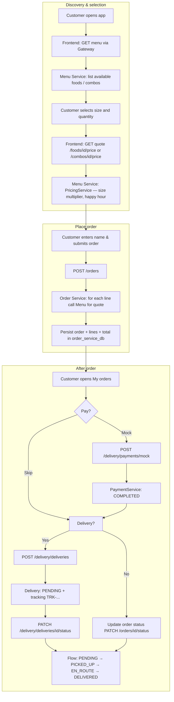
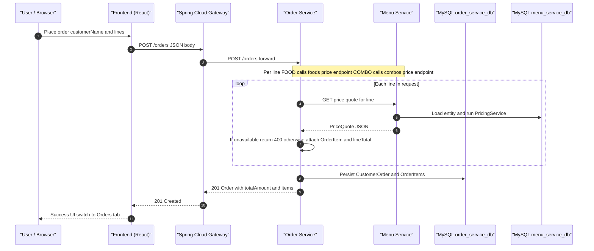
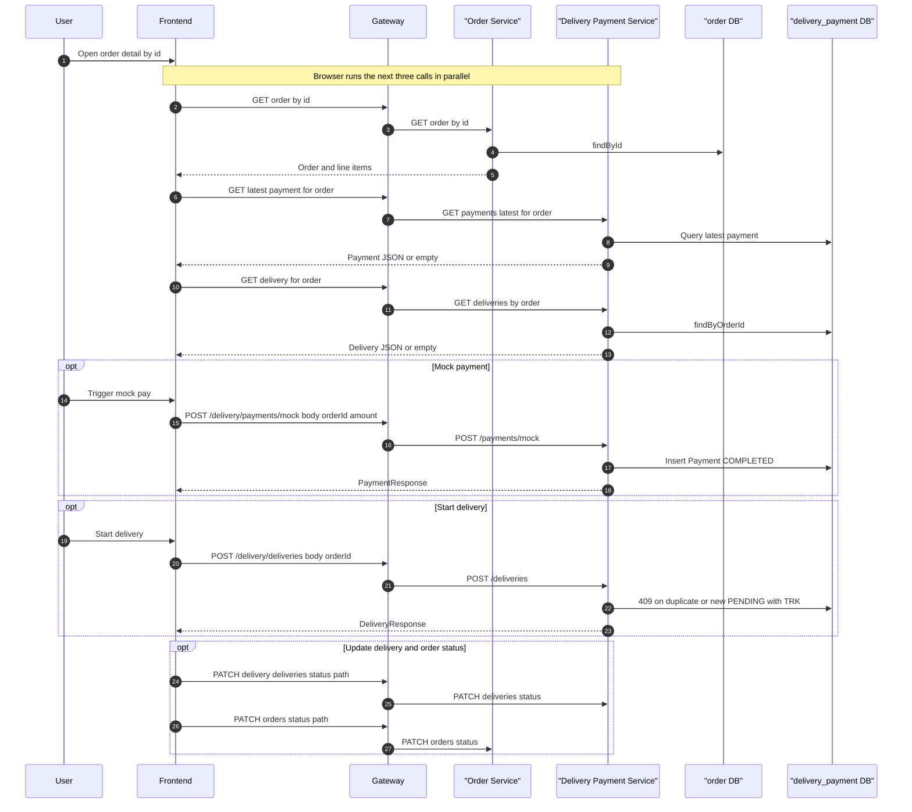
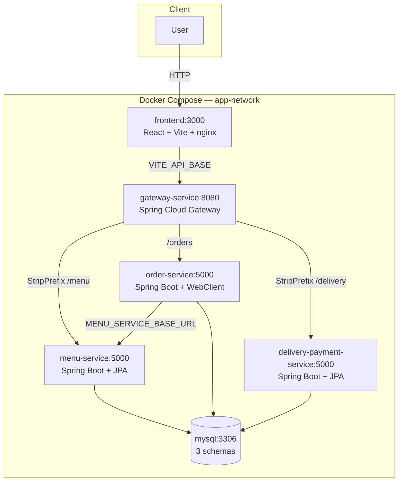
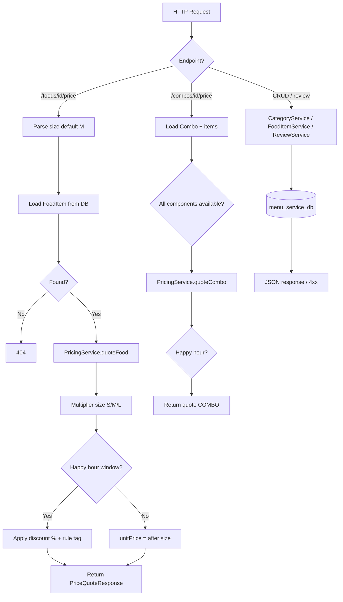
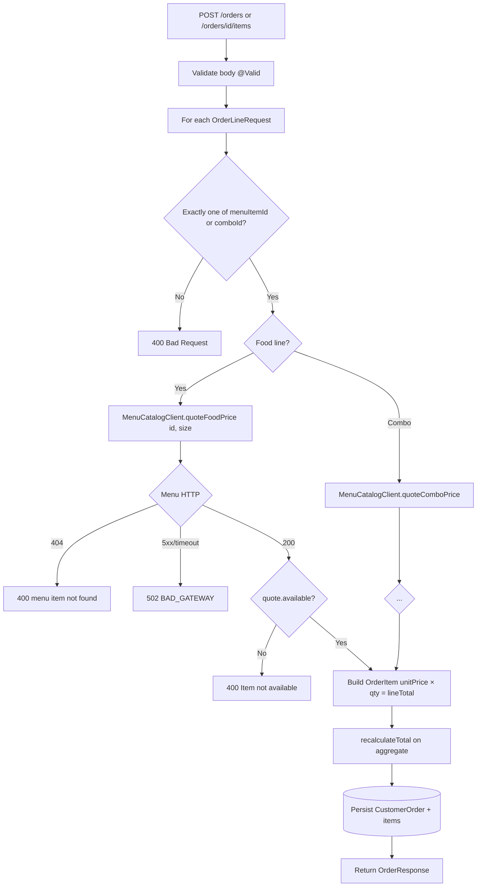
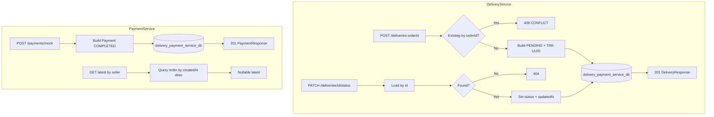

# Analysis and Design — Business Process Automation Solution

> **Goal**: Analyze a specific business process and design a service-oriented automation solution (SOA/Microservices).
> Scope: 4–6 week assignment — focus on **one business process**, not an entire system.

**References:**
1. *Service-Oriented Architecture: Analysis and Design for Services and Microservices* — Thomas Erl (2nd Edition)
2. *Microservices Patterns: With Examples in Java* — Chris Richardson
3. Hung Dang — *Service-Oriented Software Development: Exercises* (companion coursework)

**Mapping to this repository:** The **FoodOrder** system — online food ordering built with **Spring Boot 3.4 (Java 21)**, **Spring Cloud Gateway**, **MySQL 8.4** (one schema per service), **React 18 + Vite 6**, and **Docker Compose**.

---

## Part 1 — Analysis Preparation

### 1.1 Business Process Definition

The business process being automated is the **end-to-end flow of ordering food, mock payment, and delivery** for an online restaurant or food outlet.

- **Domain**: F&B (Food & Beverage) e-commerce — catalog, orders, payments, and delivery logistics (demo level).
- **Business Process**: Customers browse the menu (à la carte items and combos), choose size and quantity, obtain dynamic price quotes; submit an order; then (optionally) perform mock payment, create a shipment, and update delivery status and internal order status (kitchen / store operations).
- **Actors**:
  - **Customer**: Interacts through the web UI (React).
  - **Staff / operations (demo)**: Same UI — uses chips to update order and delivery status (simulated operational workflow).
  - **System**: API Gateway, microservices, and databases.
- **Scope**:
  - **In scope**: Read menu, price quotes, create/update orders (add/remove lines), update order status, food reviews, mock payment, create and track delivery.
  - **Out of scope for this assignment**: Real payment gateways, live maps, user authentication, physical inventory, push notifications.

**Process Diagram (high-level business flow):**

> You may add a BPMN export under `docs/asset/` and link it here if the course requires a raster/vector diagram.

### 1.2 Existing Automation Systems

The codebase is a **greenfield** application; there is no legacy system integration. Databases and services run in Docker.

| System Name | Type | Current Role | Interaction Method |
|-------------|------|--------------|-------------------|
| MySQL 8.4 | RDBMS | Three logical databases: `menu_service_db`, `order_service_db`, `delivery_payment_service_db` | JDBC (Spring Data JPA) via hostname `mysql` in Compose |
| FoodOrder microservices | REST APIs | Business logic per bounded context | HTTP/JSON; Order → Menu via `MENU_SERVICE_BASE_URL` |
| Spring Cloud Gateway | Reverse proxy / API Gateway | Single entry: CORS, routes `/menu`, `/orders`, `/delivery` | HTTP |
| Frontend (Vite + React) | SPA | Customer UI | `fetch` to gateway (`VITE_API_BASE`) |

> If describing “before this system”: *None — the process could be performed manually (phone/paper); this project automates it.*

### 1.3 Non-Functional Requirements

| Requirement | Description |
|-------------|-------------|
| **Performance** | Quotes and order creation are synchronous; Order Service calls Menu Service **per line** (WebClient, 10s timeout). The frontend parallelizes multiple quote requests when the cart changes. |
| **Security** | Environment variables for DB credentials; no hardcoded secrets. Demo: no OAuth/JWT — suitable for a learning environment only. |
| **Scalability** | Each service has its own image and can scale horizontally on Compose/K8s (currently one replica). Separate schemas per service isolate data. |
| **Availability** | `depends_on` + `condition: service_healthy` for MySQL; `GET /health` on each service and the gateway. Order depends on Menu: if Menu is down, Order returns **502 BAD_GATEWAY** when quoting. |

---

## Part 2 — REST/Microservices Modeling

### 2.1 Decompose Business Process & 2.2 Filter Unsuitable Actions

| # | Action | Actor | Description | Suitable? |
|---|--------|-------|-------------|-----------|
| 1 | Browse foods and combos | Customer | List `available` foods and combos | ✅ |
| 2 | View food detail and ratings | Customer | GET food + reviews; POST review | ✅ |
| 3 | Price quote by size / combo | System | Rules: size multiplier, happy hour (time zone) | ✅ |
| 4 | Create order with multiple lines | Customer | Each line: exactly one of `menuItemId` or `comboId` | ✅ |
| 5 | Add / remove order lines | Customer / Ops | Blocked if order is `CANCELLED` or `DELIVERED` | ✅ |
| 6 | Update order status | Ops (demo UI) | Enum: PLACED → … → DELIVERED / CANCELLED | ✅ |
| 7 | Pay | Customer | Mock: always `COMPLETED` with client-supplied amount | ✅ (simulated) |
| 8 | Create delivery for an order | Ops / Customer | One delivery per order; tracking id | ✅ |
| 9 | Update delivery status | Ops / Shipper (demo) | PENDING → PICKED_UP → EN_ROUTE → DELIVERED | ✅ |
| 10 | Judge real food quality while cooking | Chef | Subjective — not automatable | ❌ |
| 11 | Resolve payment disputes with a bank | Support | Outside mock payment scope | ❌ |

### 2.3 Entity Service Candidates

| Entity | Service Candidate | Agnostic Actions |
|--------|-------------------|------------------|
| **Category** | Menu Service | CRUD categories |
| **FoodItem** | Menu Service | CRUD, search/filter, read/add reviews, **price quote** (FOOD) |
| **Combo / Bundle** | Menu Service | CRUD (per API), **price quote** (COMBO), check component availability |
| **Review** | Menu Service (bound to Food) | List, create |
| **CustomerOrder** | Order Service | Order CRUD, line items, total, status |
| **OrderItem** | Order Service | Snapshot `menuItemName`, `unitPrice`, `lineTotal` at order time |
| **Delivery** | Delivery & Payment Service | Start by `orderId`, lookup, update status, tracking number |
| **Payment** | Delivery & Payment Service | Mock pay, list by order, latest by order |

### 2.4 Task Service Candidate

Steps that only make sense in the context of **a single ordering session** or **UI orchestration** are not split into separate services in code — they live in the **Frontend** (aggregating multiple APIs) or the **Order Service** (pricing via Menu).

| Non-agnostic Action | Task Service Candidate |
|---------------------|------------------------|
| “Checkout once” with a mixed food+combo cart; validate availability from quotes | **Order Service** (`create` / `addLines` + `MenuCatalogClient`) |
| Order detail dashboard: combine order + latest payment + delivery by order | **Frontend** (three parallel calls via Gateway) |

### 2.5 Identify Resources

Client-facing paths through the Gateway (external prefix):

| Entity / Process | Resource URI (via Gateway) |
|------------------|----------------------------|
| Health (per tier) | `GET /health` (gateway); backend `/menu/...` with strip prefix → service `/...` |
| Categories | `/menu/categories`, `/menu/categories/{id}` |
| Foods | `/menu/foods`, `/menu/foods/{id}`, `/menu/foods/{id}/price`, `/menu/foods/{id}/reviews`, `/menu/foods/{id}/review` |
| Combos | `/menu/combos`, `/menu/combos/{id}`, `/menu/combos/{id}/price` |
| Orders | `/orders`, `/orders/{id}`, `/orders/{id}/items`, `/orders/{orderId}/items/{itemId}`, `/orders/{id}/status` |
| Deliveries | `/delivery/deliveries`, `/delivery/deliveries/orders/{orderId}`, `/delivery/deliveries/{id}/status` |
| Payments | `/delivery/payments/mock`, `/delivery/payments/orders/{orderId}`, `/delivery/payments/orders/{orderId}/latest` |

Inside containers (Compose DNS): `http://menu-service:5000`, `http://order-service:5000`, `http://delivery-payment-service:5000` — **no** `/menu` or `/delivery` prefix when Order calls Menu.

### 2.6 Associate Capabilities with Resources and Methods

| Service Candidate | Capability | Resource (internal service path) | HTTP Method |
|-------------------|------------|-----------------------------------|-------------|
| Menu Service | Health | `/health` | GET |
| Menu Service | List / create categories | `/categories` | GET, POST |
| Menu Service | Get / update / delete category | `/categories/{id}` | GET, PUT, DELETE |
| Menu Service | Search foods | `/foods` | GET |
| Menu Service | CRUD food | `/foods`, `/foods/{id}` | POST, GET, PUT, DELETE |
| Menu Service | Price quote food | `/foods/{id}/price?size=` | GET |
| Menu Service | List / add reviews | `/foods/{id}/reviews`, `/foods/{id}/review` | GET, POST |
| Menu Service | List / create / get combo, quote | `/combos`, `/combos/{id}`, `/combos/{id}/price` | GET, POST, GET, GET |
| Order Service | Health | `/health` | GET |
| Order Service | List / create orders | `/orders` | GET, POST |
| Order Service | Get order | `/orders/{id}` | GET |
| Order Service | Add lines | `/orders/{id}/items` | POST |
| Order Service | Remove line | `/orders/{orderId}/items/{itemId}` | DELETE |
| Order Service | Update status | `/orders/{id}/status` | PATCH |
| Delivery & Payment | Health | `/health` | GET |
| Delivery & Payment | Start delivery | `/deliveries` | POST |
| Delivery & Payment | Find delivery by order | `/deliveries/orders/{orderId}` | GET |
| Delivery & Payment | Update delivery status | `/deliveries/{id}/status` | PATCH |
| Delivery & Payment | Mock payment | `/payments/mock` | POST |
| Delivery & Payment | Payments by order | `/payments/orders/{orderId}` | GET |
| Delivery & Payment | Latest payment | `/payments/orders/{orderId}/latest` | GET |

### 2.7 Utility Service & Microservice Candidates

| Candidate | Type (Utility / Microservice) | Justification |
|-----------|-------------------------------|---------------|
| **gateway-service** | Utility (Edge) | Routing, `StripPrefix` for `/menu/**` and `/delivery/**`, global CORS; no domain logic. |
| **menu-service** | Microservice | Catalog + pricing + reviews; dedicated database. |
| **order-service** | Microservice | Order bounded context; synchronous orchestration to Menu for **authoritative price** at order time. |
| **delivery-payment-service** | Microservice | Mock payment and delivery fulfillment; dedicated database; references `orderId` as a contract identifier without cross-database FKs. |
| **Health endpoints** | Utility (Observability) | Standard `{"status":"ok"}` for Compose healthchecks. |

> **Not used** in this repo: distributed Saga, message broker, circuit breaker (e.g. Resilience4j) — potential future NFR work.

### 2.8 Service Composition Candidates

**Flow 1 — Create order (Order Service coordinates; calls Menu for quotes):**

**Flow 2 — After order: mock payment + delivery (Frontend orchestration; no backend orchestrator):**

**Component diagram (Docker Compose deployment):**

---

## Part 3 — Service-Oriented Design

### 3.1 Uniform Contract Design

REST contracts are described with OpenAPI 3.0:

- [`docs/api-specs/menu-service.yaml`](api-specs/menu-service.yaml)
- [`docs/api-specs/order-service.yaml`](api-specs/order-service.yaml)
- [`docs/api-specs/delivery-payment-service.yaml`](api-specs/delivery-payment-service.yaml) — *the YAML currently documents only `/health`; the table below reflects the **running code** — extend OpenAPI to match.*

**Menu Service** (media type `application/json` unless noted):

| Endpoint | Method | Media Type | Response Codes |
|----------|--------|------------|----------------|
| `/health` | GET | application/json | 200 |
| `/categories` | GET, POST | application/json | 200, 201 |
| `/categories/{id}` | GET, PUT, DELETE | application/json | 200, 204, 404 |
| `/foods` | GET, POST | application/json | 200, 201 |
| `/foods/{id}` | GET, PUT, DELETE | application/json | 200, 204, 404 |
| `/foods/{id}/price` | GET | application/json | 200, 404 |
| `/foods/{id}/reviews` | GET | application/json | 200, 404 |
| `/foods/{id}/review` | POST | application/json | 201, 404 |
| `/combos` | GET, POST | application/json | 200, 201 |
| `/combos/{id}` | GET | application/json | 200, 404 |
| `/combos/{id}/price` | GET | application/json | 200, 404 |

**Order Service:**

| Endpoint | Method | Media Type | Response Codes |
|----------|--------|------------|----------------|
| `/health` | GET | application/json | 200 |
| `/orders` | GET | application/json | 200 |
| `/orders` | POST | application/json | 201, 400, 502 |
| `/orders/{id}` | GET | application/json | 200, 404 |
| `/orders/{id}/items` | POST | application/json | 200, 400, 409 |
| `/orders/{orderId}/items/{itemId}` | DELETE | application/json | 200, 404, 409 |
| `/orders/{id}/status` | PATCH | application/json | 200, 404 |

**Delivery & Payment Service** (per implementation):

| Endpoint | Method | Media Type | Response Codes |
|----------|--------|------------|----------------|
| `/health` | GET | application/json | 200 |
| `/deliveries` | POST | application/json | 201, 400, 409 (delivery already exists for order) |
| `/deliveries/orders/{orderId}` | GET | application/json | 200 (`delivery` may be null) |
| `/deliveries/{id}/status` | PATCH | application/json | 200, 404 |
| `/payments/mock` | POST | application/json | 201 |
| `/payments/orders/{orderId}` | GET | application/json | 200 |
| `/payments/orders/{orderId}/latest` | GET | application/json | 200 (`payment` may be null) |

### 3.2 Service Logic Design

**Menu Service** — internal processing (catalog + **PricingService** with `MenuPricingProperties`: size multiplier, happy hour via zoned `Clock`):

**Order Service** — building order lines **requires** **MenuCatalogClient** (Spring WebClient, blocking, 10s timeout):

**Delivery & Payment Service** — separate **Delivery** and **Payment** flows (does not call Order Service; trusts client-supplied `orderId`):

---

### Pattern summary (Chris Richardson mapping)

| Pattern | Use in this project |
|---------|---------------------|
| **API Gateway** | `gateway-service` — routing, CORS, strip prefix. |
| **Database per Service** | Three separate MySQL schemas; no shared tables across services. |
| **Domain Service** (agnostic) | Menu Service (catalog, pricing rules). |
| **Service collaboration** | Order calls Menu synchronously for price and name snapshot. |
| **Frontend API composition** | Order detail view calls Order + Payment + Delivery in parallel. |

Additional deployment architecture: [`docs/architecture.md`](architecture.md).
