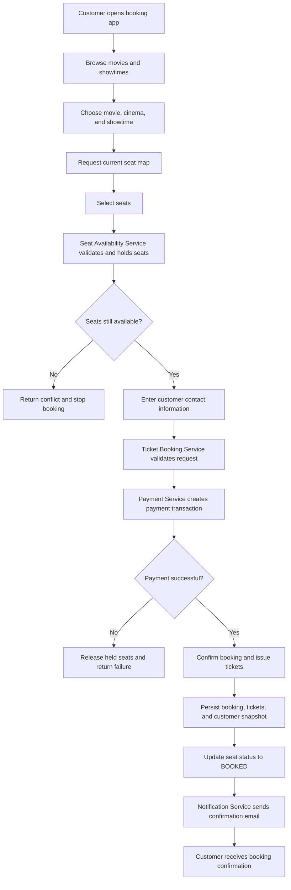
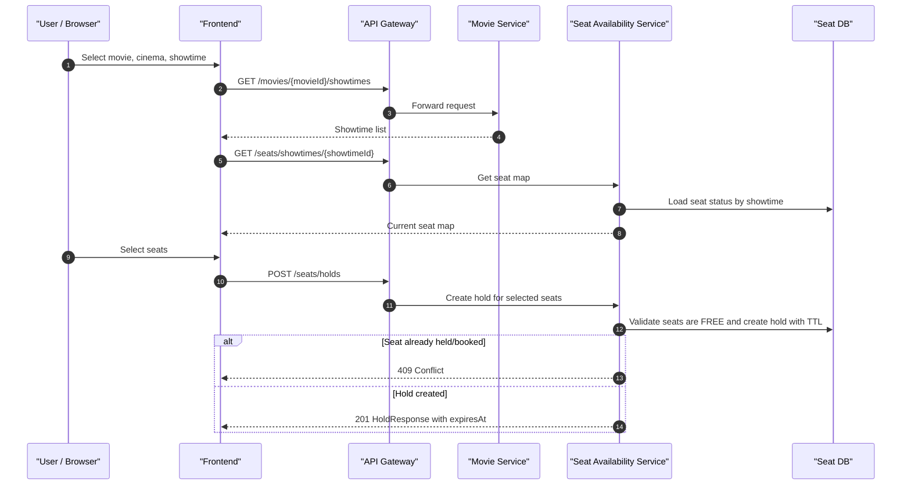
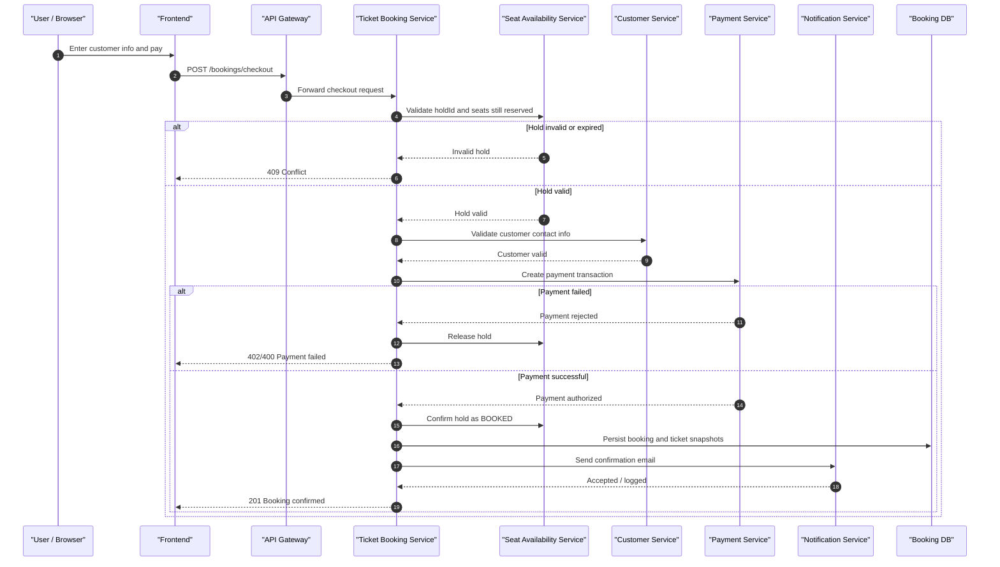
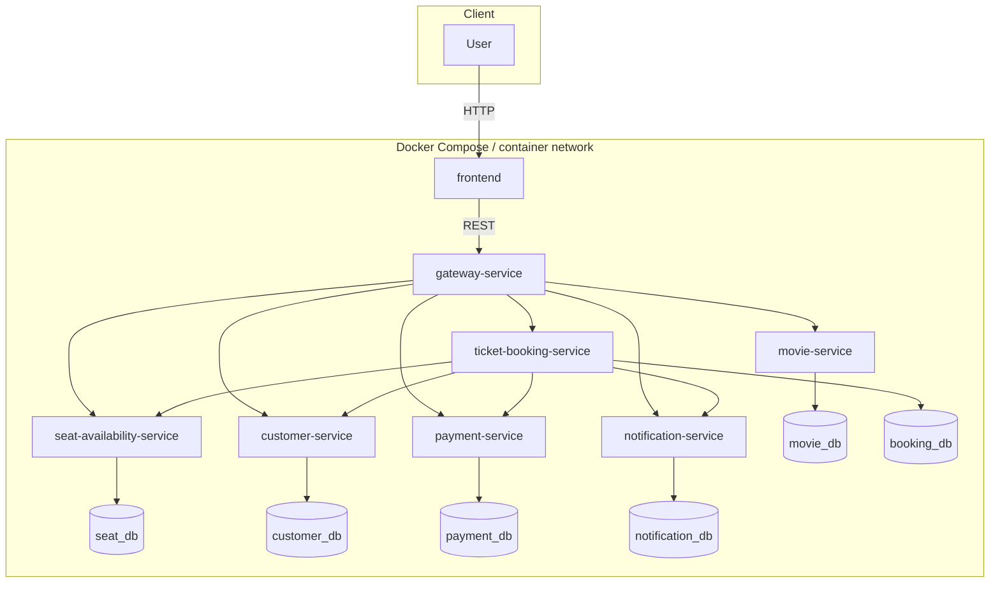
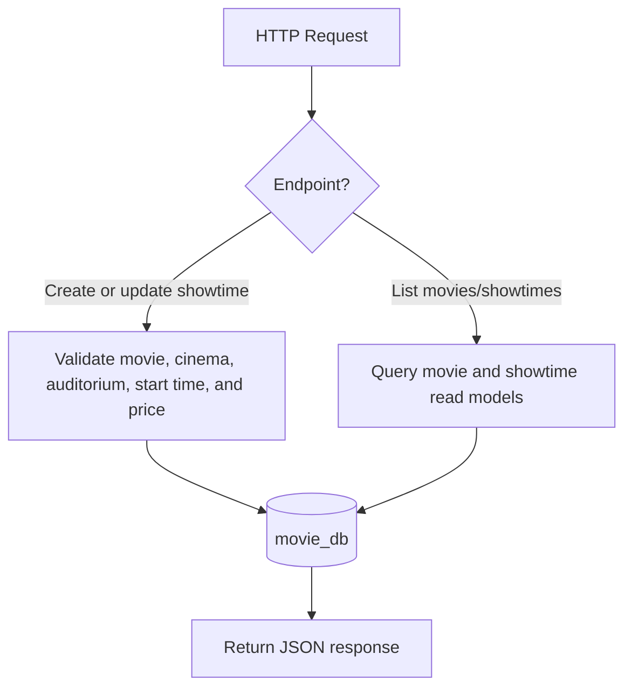
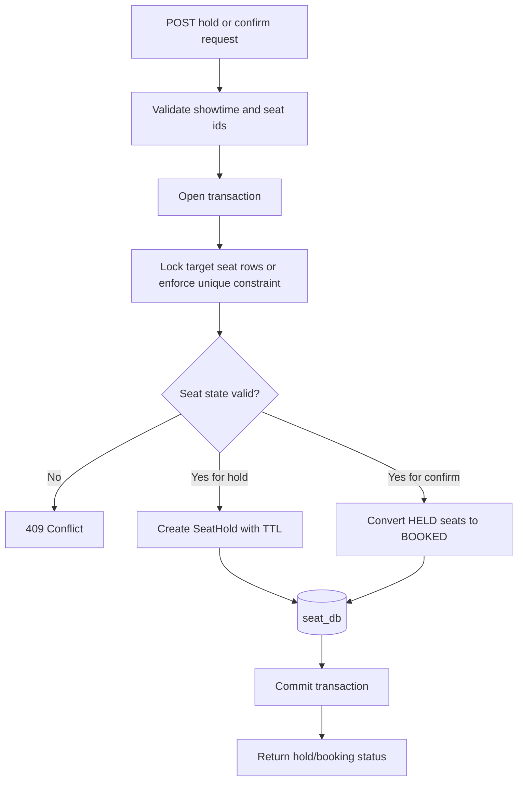
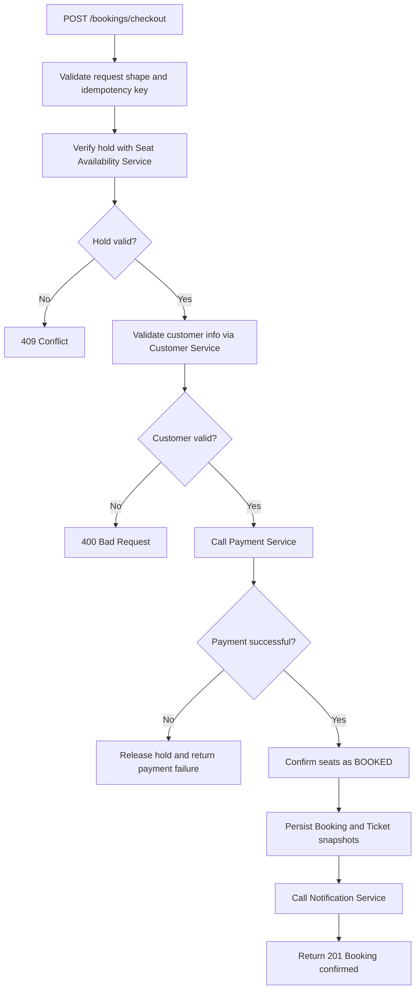
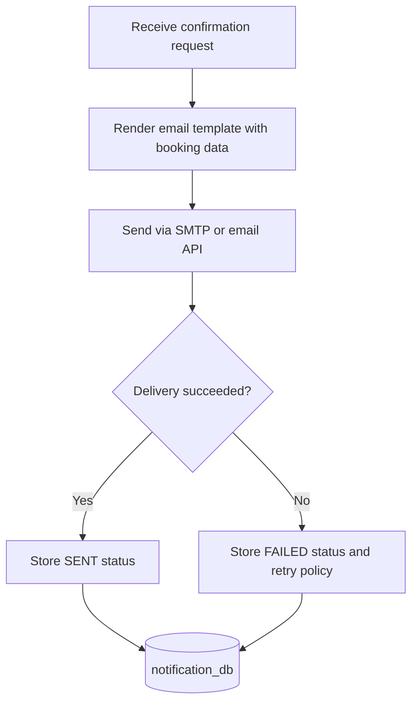

# Analysis and Design — Business Process Automation Solution

> **Goal**: Analyze a specific business process and design a service-oriented automation solution (SOA/Microservices).
> Scope: 4–6 week assignment — focus on **one business process**, not an entire enterprise platform.

**References:**
1. *Service-Oriented Architecture: Analysis and Design for Services and Microservices* — Thomas Erl (2nd Edition)
2. *Microservices Patterns: With Examples in Java* — Chris Richardson
3. Hung Dang — *Service-Oriented Software Development: Exercises* (companion coursework)

**Mapping to this repository:** The target solution is a **Cinema Ticket Booking** system. Customers browse movies and showtimes, choose seats, provide contact information, pay online, and receive booking confirmation by email.

---

## Part 1 — Analysis Preparation

### 1.1 Business Process Definition

The business process being automated is the **end-to-end flow of booking cinema tickets online**, from movie discovery to seat reservation, payment, and confirmation notification.

- **Domain**: Cinema / entertainment ticketing.
- **Business Process**: A customer selects a movie, theater, and showtime; chooses one or more seats; the system validates real-time seat availability, verifies ticket and customer information, processes online payment, issues the booking, and sends a confirmation email.
- **Actors**:
  - **Customer**: Browses movies, selects showtimes and seats, enters contact information, and pays online.
  - **Cinema Operations Staff**: Maintains movie schedules, theater/auditorium information, pricing rules, and seat maps.
  - **Payment Gateway**: External payment processor that authorizes or rejects payment.
  - **Email Provider / Notification Channel**: Sends booking confirmation to the customer.
  - **System**: API Gateway, microservices, and databases.
- **Scope**:
  - **In scope**: Browse movies and showtimes, view seat map, hold and validate seats, collect customer information, create booking, process online payment, issue e-ticket / booking record, send email confirmation.
  - **Out of scope for this assignment**: Refunds, loyalty points, discount campaigns, food combo sales, user authentication/authorization, QR gate scanning, cashier POS integration, and real-time analytics dashboards.

**Process Diagram (high-level business flow):**

> A BPMN or exported diagram may be added under `docs/asset/` if required by the course.

### 1.2 Existing Automation Systems

This solution is treated as a **greenfield** service-oriented application. There is no legacy cinema booking system integrated into the first version.

| System Name | Type | Current Role | Interaction Method |
|-------------|------|--------------|-------------------|
| Cinema Booking microservices | REST APIs | Core business capabilities for movie catalog, seat availability, booking, payment, customer data, and notifications | HTTP/JSON via API Gateway |
| Relational database(s) | RDBMS | Persist movies, showtimes, seat inventory, customers, bookings, and payment records | Service-owned schema access |
| Payment gateway sandbox | External service | Simulates or performs online payment authorization | HTTPS API |
| SMTP / email delivery provider | External service | Delivers booking confirmation email to customer | SMTP or HTTPS API |

> If describing the pre-automation state: *The ticket booking process could be handled manually at the ticket counter or by phone. This system digitizes the workflow for faster self-service booking.*

### 1.3 Non-Functional Requirements

| Requirement | Description |
|-------------|-------------|
| **Performance** | Seat availability checks must be low-latency because many users may compete for the same showtime. Seat holds should be short-lived (for example 3-5 minutes) to prevent stale reservations. |
| **Consistency** | The system must prevent double-booking of the same seat for the same showtime. Seat hold and booking confirmation require concurrency control, such as transactional locking and a uniqueness constraint on `(showtimeId, seatId)`. |
| **Security** | Customer PII and payment data must be protected. Secrets come from environment variables, not source code. Payment card data should not be stored directly unless delegated to a compliant payment gateway. |
| **Scalability** | Popular releases can cause spikes on movie browsing, seat map lookup, and booking confirmation. Services should be independently deployable and horizontally scalable. |
| **Availability** | Booking should fail fast if payment cannot be completed or seats become unavailable. Notification failure should not invalidate an already paid booking; instead the system should record the failure and retry asynchronously. |
| **Observability** | Every service exposes `GET /health` and should emit logs for booking attempts, payment outcomes, and notification delivery status. |

---

## Part 2 — REST/Microservices Modeling

### 2.1 Decompose Business Process & 2.2 Filter Unsuitable Actions

| # | Action | Actor | Description | Suitable? |
|---|--------|-------|-------------|-----------|
| 1 | Browse movies | Customer | View available movies with metadata, poster, genre, duration, and rating | ✅ |
| 2 | Browse cinemas and showtimes | Customer | View theaters, auditoriums, and schedules for a selected movie | ✅ |
| 3 | View seat map | Customer | Load current seat availability for a specific showtime | ✅ |
| 4 | Select seats | Customer | Choose one or more seats from the available seat map | ✅ |
| 5 | Validate and temporarily hold seats | System | Ensure selected seats are still free and reserve them for a short time window | ✅ |
| 6 | Enter customer information | Customer | Provide full name, phone number, and email address | ✅ |
| 7 | Verify ticket details | System | Validate showtime, seat hold, price calculation, and booking request completeness | ✅ |
| 8 | Process online payment | Customer + System | Send payment request to payment gateway and receive success/failure result | ✅ |
| 9 | Confirm booking and issue tickets | System | Generate booking record and ticket(s) after successful payment | ✅ |
| 10 | Send confirmation email | System | Deliver booking details and ticket confirmation to the customer's email | ✅ |
| 11 | Update movie review sentiment manually | Staff | Subjective editorial work; not part of ticket-booking flow | ❌ |
| 12 | Negotiate bank chargeback disputes | Support staff | Out of scope for the booking use case | ❌ |

### 2.3 Entity Service Candidates

| Entity | Service Candidate | Agnostic Actions |
|--------|-------------------|------------------|
| **Movie** | Movie Service | CRUD movies, publish/unpublish movie metadata |
| **Cinema / Theater** | Movie Service | CRUD theater locations and cinema details |
| **Auditorium** | Movie Service | Manage room layout, seat configuration, and auditorium metadata |
| **Showtime** | Movie Service | CRUD showtimes, map movie to theater/auditorium, maintain base ticket pricing |
| **SeatHold** | Seat Availability Service | Create hold, extend hold, expire hold, release hold |
| **SeatReservation** | Seat Availability Service | Query seat status, confirm booked seats, enforce uniqueness by showtime and seat |
| **CustomerProfile** | Customer Service | Create/update guest customer profile, validate contact data, search by email or phone |
| **PaymentTransaction** | Payment Service | Create payment intent, authorize/capture payment, query transaction result |
| **Booking** | Ticket Booking Service | Create booking, fetch booking detail, update booking status |
| **Ticket** | Ticket Booking Service | Issue ticket per seat, store ticket code / QR token / seat snapshot |
| **NotificationLog** | Notification Service | Record delivery attempts, retry failed confirmation emails |

### 2.4 Task Service Candidate

The central business task is not simple CRUD. It is a multi-step orchestration that spans seat validation, customer information validation, payment, booking issuance, and confirmation.

| Non-agnostic Action | Task Service Candidate |
|---------------------|------------------------|
| Complete booking workflow for selected movie, showtime, and seats | **Ticket Booking Service** |
| Create a temporary reservation window for selected seats before payment | **Seat Availability Service** |
| Send booking confirmation to the customer after successful booking | **Notification Service** |

> Senior design note: although the original problem statement groups seat status under Movie Service, the live occupancy and locking logic is separated into **Seat Availability Service** to avoid mixing catalog metadata with high-contention seat reservation logic.

### 2.5 Identify Resources

Client-facing paths through the Gateway (external prefix):

| Entity / Process | Resource URI (via Gateway) |
|------------------|----------------------------|
| Health (per tier) | `GET /health` (gateway) and `GET /health` on each backend service |
| Movies | `/movies`, `/movies/{movieId}` |
| Cinemas / Theaters | `/cinemas`, `/cinemas/{cinemaId}` |
| Showtimes | `/showtimes`, `/showtimes/{showtimeId}`, `/movies/{movieId}/showtimes` |
| Seat map / seat status | `/seats/showtimes/{showtimeId}`, `/seats/showtimes/{showtimeId}/availability` |
| Seat holds | `/seats/holds`, `/seats/holds/{holdId}`, `/seats/holds/{holdId}/release` |
| Customers | `/customers`, `/customers/validate`, `/customers/lookup` |
| Payments | `/payments`, `/payments/{paymentId}`, `/payments/{paymentId}/confirm` |
| Bookings | `/bookings`, `/bookings/{bookingId}`, `/bookings/{bookingId}/tickets` |
| Booking task / checkout | `/bookings/checkout` |
| Notifications | `/notifications/booking-confirmations`, `/notifications/{notificationId}` |

Inside containers (Compose DNS), services communicate by service name, for example:

- `http://movie-service:5000`
- `http://seat-availability-service:5000`
- `http://customer-service:5000`
- `http://payment-service:5000`
- `http://ticket-booking-service:5000`
- `http://notification-service:5000`

### 2.6 Associate Capabilities with Resources and Methods

| Service Candidate | Capability | Resource (internal service path) | HTTP Method |
|-------------------|------------|-----------------------------------|-------------|
| Movie Service | Health | `/health` | GET |
| Movie Service | List / create movies | `/movies` | GET, POST |
| Movie Service | Get / update / delete movie | `/movies/{movieId}` | GET, PUT, DELETE |
| Movie Service | List cinemas | `/cinemas` | GET |
| Movie Service | List / create showtimes | `/showtimes` | GET, POST |
| Movie Service | Get / update / delete showtime | `/showtimes/{showtimeId}` | GET, PUT, DELETE |
| Movie Service | List showtimes by movie | `/movies/{movieId}/showtimes` | GET |
| Seat Availability Service | Health | `/health` | GET |
| Seat Availability Service | Get seat map by showtime | `/showtimes/{showtimeId}/seats` | GET |
| Seat Availability Service | Check seat availability | `/showtimes/{showtimeId}/availability` | POST |
| Seat Availability Service | Create temporary seat hold | `/holds` | POST |
| Seat Availability Service | Get seat hold | `/holds/{holdId}` | GET |
| Seat Availability Service | Release seat hold | `/holds/{holdId}/release` | POST |
| Seat Availability Service | Confirm held seats as booked | `/holds/{holdId}/confirm` | POST |
| Customer Service | Health | `/health` | GET |
| Customer Service | Create / update customer | `/customers` | POST, PUT |
| Customer Service | Lookup customer | `/customers/lookup` | GET |
| Customer Service | Validate customer booking info | `/customers/validate` | POST |
| Payment Service | Health | `/health` | GET |
| Payment Service | Create payment transaction | `/payments` | POST |
| Payment Service | Get payment by id | `/payments/{paymentId}` | GET |
| Payment Service | Confirm payment result | `/payments/{paymentId}/confirm` | POST |
| Ticket Booking Service | Health | `/health` | GET |
| Ticket Booking Service | Create booking through orchestration | `/bookings/checkout` | POST |
| Ticket Booking Service | Get booking detail | `/bookings/{bookingId}` | GET |
| Ticket Booking Service | List booking tickets | `/bookings/{bookingId}/tickets` | GET |
| Ticket Booking Service | Cancel unpaid / failed booking | `/bookings/{bookingId}/cancel` | POST |
| Notification Service | Health | `/health` | GET |
| Notification Service | Send booking confirmation | `/notifications/booking-confirmations` | POST |
| Notification Service | Query notification result | `/notifications/{notificationId}` | GET |

### 2.7 Utility Service & Microservice Candidates

| Candidate | Type (Utility / Microservice) | Justification |
|-----------|-------------------------------|---------------|
| **gateway-service** | Utility (Edge) | Single entry point, request routing, CORS, and cross-cutting policies. |
| **movie-service** | Entity service / microservice | Owns movie catalog, theater metadata, auditorium definitions, and showtimes. |
| **seat-availability-service** | Microservice | Owns live seat occupancy, temporary holds, concurrency control, and seat booking confirmation. |
| **customer-service** | Entity service / microservice | Owns customer contact information and validation rules for booking data. |
| **payment-service** | Entity service / microservice | Owns payment transaction lifecycle and integration with payment gateway. |
| **ticket-booking-service** | Task service / microservice | Orchestrates the booking workflow across services and persists booking/ticket aggregates. |
| **notification-service** | Utility service / microservice | Sends confirmation email and logs delivery attempts independently from booking success. |
| **Health endpoints** | Utility (Observability) | Standard `{"status":"ok"}` endpoint for service monitoring and container health checks. |

> Not used initially: distributed Saga orchestrator, message broker, recommendation engine, refund service, or service registry. These can be introduced later if scale and failure-handling requirements grow.

### 2.8 Service Composition Candidates

**Flow 1 — Seat selection and hold (Seat Availability Service coordinates the high-contention part):**

**Flow 2 — Booking checkout (Ticket Booking Service orchestrates end-to-end completion):**

**Component diagram (conceptual deployment):**

---

## Part 3 — Service-Oriented Design

### 3.1 Uniform Contract Design

REST contracts should be described with OpenAPI 3.0 under `docs/api-specs/`, ideally one specification per service.

**Movie Service**:

| Endpoint | Method | Media Type | Response Codes |
|----------|--------|------------|----------------|
| `/health` | GET | application/json | 200 |
| `/movies` | GET, POST | application/json | 200, 201 |
| `/movies/{movieId}` | GET, PUT, DELETE | application/json | 200, 204, 404 |
| `/showtimes` | GET, POST | application/json | 200, 201 |
| `/showtimes/{showtimeId}` | GET, PUT, DELETE | application/json | 200, 204, 404 |
| `/movies/{movieId}/showtimes` | GET | application/json | 200 |

**Seat Availability Service**:

| Endpoint | Method | Media Type | Response Codes |
|----------|--------|------------|----------------|
| `/health` | GET | application/json | 200 |
| `/showtimes/{showtimeId}/seats` | GET | application/json | 200, 404 |
| `/showtimes/{showtimeId}/availability` | POST | application/json | 200, 404, 409 |
| `/holds` | POST | application/json | 201, 400, 409 |
| `/holds/{holdId}` | GET | application/json | 200, 404 |
| `/holds/{holdId}/release` | POST | application/json | 200, 404, 409 |
| `/holds/{holdId}/confirm` | POST | application/json | 200, 404, 409 |

**Customer Service**:

| Endpoint | Method | Media Type | Response Codes |
|----------|--------|------------|----------------|
| `/health` | GET | application/json | 200 |
| `/customers` | POST, PUT | application/json | 200, 201, 400 |
| `/customers/lookup` | GET | application/json | 200, 404 |
| `/customers/validate` | POST | application/json | 200, 400 |

**Payment Service**:

| Endpoint | Method | Media Type | Response Codes |
|----------|--------|------------|----------------|
| `/health` | GET | application/json | 200 |
| `/payments` | POST | application/json | 201, 400, 402 |
| `/payments/{paymentId}` | GET | application/json | 200, 404 |
| `/payments/{paymentId}/confirm` | POST | application/json | 200, 400, 409 |

**Ticket Booking Service**:

| Endpoint | Method | Media Type | Response Codes |
|----------|--------|------------|----------------|
| `/health` | GET | application/json | 200 |
| `/bookings/checkout` | POST | application/json | 201, 400, 402, 409, 502 |
| `/bookings/{bookingId}` | GET | application/json | 200, 404 |
| `/bookings/{bookingId}/tickets` | GET | application/json | 200, 404 |
| `/bookings/{bookingId}/cancel` | POST | application/json | 200, 404, 409 |

**Notification Service**:

| Endpoint | Method | Media Type | Response Codes |
|----------|--------|------------|----------------|
| `/health` | GET | application/json | 200 |
| `/notifications/booking-confirmations` | POST | application/json | 202, 400 |
| `/notifications/{notificationId}` | GET | application/json | 200, 404 |

### 3.2 Service Logic Design

**Movie Service** — manages relatively stable catalog metadata and scheduling:

**Seat Availability Service** — manages real-time seat occupancy and hold lifecycle:

**Ticket Booking Service** — orchestrates the full ticket booking transaction at service level:

**Notification Service** — decouples confirmation delivery from booking success:

---

### Pattern summary (Chris Richardson mapping)

| Pattern | Use in this project |
|---------|---------------------|
| **API Gateway** | Single entry for frontend clients, routing requests to domain services. |
| **Database per Service** | Each service owns its own schema or datastore boundary to avoid tight coupling. |
| **Task Service** | Ticket Booking Service orchestrates booking completion across entity and utility services. |
| **Entity Service** | Movie, Customer, and Payment Services expose reusable business capabilities around core entities. |
| **Utility Service** | Notification Service handles cross-cutting outbound communication without owning booking decisions. |
| **High-contention microservice** | Seat Availability Service isolates concurrency-heavy seat hold and booking logic. |
| **Synchronous service collaboration** | Ticket Booking Service synchronously validates hold, customer data, and payment before confirmation. |
| **Compensating action** | If payment fails, held seats are explicitly released before returning failure. |

Additional deployment architecture is documented in `docs/architecture.md`.
