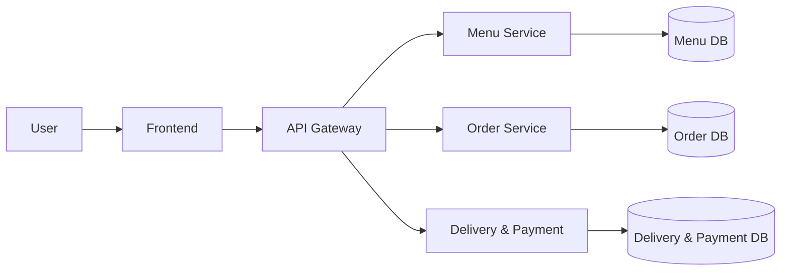

# System Architecture

> This document is completed **after** [Analysis and Design](analysis-and-design.md).
> Based on the Service Candidates and Non-Functional Requirements identified there, select appropriate architecture patterns and design the deployment architecture.

**References:**
1. *Service-Oriented Architecture: Analysis and Design for Services and Microservices* — Thomas Erl (2nd Edition)
2. *Microservices Patterns: With Examples in Java* — Chris Richardson
3. *Bài tập — Phát triển phần mềm hướng dịch vụ* — Hung Dang (available in Vietnamese)

---

## 1. Pattern Selection

Select patterns based on business/technical justifications from your analysis.

| Pattern | Selected? | Business/Technical Justification |
|---------|-----------|----------------------------------|
| API Gateway | | |
| Database per Service | | |
| Shared Database | | |
| Saga | | |
| Event-driven / Message Queue | | |
| CQRS | | |
| Circuit Breaker | | |
| Service Registry / Discovery | | |
| Other: ___ | | |

> Reference: *Microservices Patterns* — Chris Richardson, chapters on decomposition, data management, and communication patterns.

---

## 2. System Components

| Component     | Responsibility | Tech Stack      | Port  |
|---------------|----------------|-----------------|-------|
| **Frontend**  |                | *(your choice)* | 3000  |
| **Gateway**   |                | *(your choice)* | 8080  |
| **Menu Service** |                | *(your choice)* | 5001  |
| **Order Service** |                | *(your choice)* | 5002  |
| **Delivery & Payment Service** |                | *(your choice)* | 5003  |
| **Database**  |                | *(your choice)* | 5432  |

---

## 3. Communication

### Inter-service Communication Matrix

| From → To     | Menu Service | Order Service | Delivery & Payment | Gateway | Database |
|---------------|--------------|---------------|--------------------|---------|----------|
| **Frontend**  |              |               |                    |         |          |
| **Gateway**   |              |               |                    |         |          |
| **Menu Service** |           |               |                    |         |          |
| **Order Service** |          |               |                    |         |          |
| **Delivery & Payment** |     |               |                    |         |          |

---

## 4. Architecture Diagram

> Place diagrams in `docs/asset/` and reference here.

---

## 5. Deployment

- All services containerized with Docker
- Orchestrated via Docker Compose
- Single command: `docker compose up --build`
