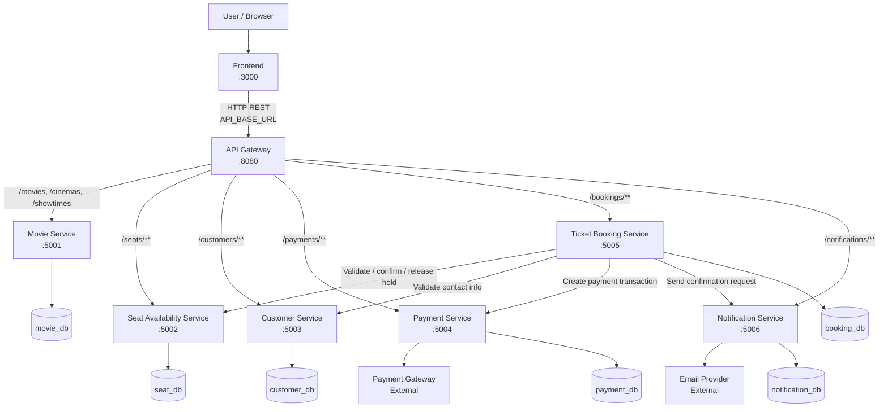

# System Architecture

> This document is completed **after** [Analysis and Design](analysis-and-design.md).
> Based on the Service Candidates and Non-Functional Requirements identified there, select appropriate architecture patterns and design the deployment architecture.

**References:**
1. *Service-Oriented Architecture: Analysis and Design for Services and Microservices* — Thomas Erl (2nd Edition)
2. *Microservices Patterns: With Examples in Java* — Chris Richardson
3. *Bài tập — Phát triển phần mềm hướng dịch vụ* — Hung Dang (available in Vietnamese)

---

## 1. Pattern Selection

Select patterns based on business/technical justifications from your analysis.

| Pattern | Selected? | Business/Technical Justification |
|---------|-----------|----------------------------------|
| API Gateway | Yes | The frontend accesses the system through a single entry point. The Gateway routes requests to the correct backend service and hides internal service addresses from the client. |
| Database per Service | Yes | Each service owns its own schema or datastore boundary so that movie, seat, customer, payment, booking, and notification data can evolve independently. |
| Shared Database | No | A shared database would tightly couple services and make seat reservation, booking, and payment changes harder to isolate safely. |
| Saga | No | The first version uses synchronous orchestration inside `ticket-booking-service` with a simple compensating action: release held seats if payment fails. |
| Event-driven / Message Queue | No | Not required for the initial scope. Notification retry can be added later, but the core booking flow is implemented with synchronous service calls. |
| CQRS | No | The current scale does not require separate read and write models. Standard transactional services are sufficient. |
| Circuit Breaker | No | Useful in production, but not mandatory for the assignment scope. Timeout handling and explicit failure responses are sufficient initially. |
| Service Registry / Discovery | No | Docker Compose DNS is enough for service-to-service communication, so a dedicated discovery service is unnecessary. |
| Synchronous REST (inter-service call) | Yes | `ticket-booking-service` synchronously calls seat availability, customer, payment, and notification services to complete one booking request deterministically. |
| Other: Short-lived Seat Hold | Yes | A temporary seat-hold pattern with TTL prevents double-booking while giving the customer a limited payment window. |

> Reference: *Microservices Patterns* — Chris Richardson, chapters on decomposition, data management, and communication patterns.

---

## 2. System Components

| Component     | Responsibility | Tech Stack      | Port  |
|---------------|----------------|-----------------|-------|
| **Frontend**  | User interface for browsing movies, selecting showtimes and seats, entering customer information, paying online, and viewing booking confirmation. Communicates only through the API Gateway. | Frontend SPA (team-selected) | 3000 |
| **Gateway**   | Single entry point for all client requests. Routes traffic to backend services and handles CORS and edge-level concerns. Stores no business data. | API Gateway / reverse proxy (team-selected) | 8080 |
| **Movie Service** | Manages movie catalog, cinemas, auditoriums, and showtimes. Provides the reference data required to start the booking flow. | REST service + service-owned database | 5001 |
| **Seat Availability Service** | Manages real-time seat status, temporary seat holds, hold expiration, and seat booking confirmation. Prevents double-booking for the same showtime and seat. | REST service + service-owned database | 5002 |
| **Customer Service** | Manages guest customer information and validates booking contact details such as full name, phone number, and email. | REST service + service-owned database | 5003 |
| **Payment Service** | Manages payment transactions and integration with the external payment gateway. Returns payment success or failure for a booking attempt. | REST service + service-owned database | 5004 |
| **Ticket Booking Service** | Task service that orchestrates the booking workflow: validate seat hold, validate customer info, trigger payment, persist booking/tickets, and request confirmation notification. | REST service + service-owned database | 5005 |
| **Notification Service** | Sends booking confirmation email and records notification delivery attempts. Notification failure does not invalidate a successfully paid booking. | REST service + service-owned database | 5006 |
| **Database(s)**  | Persist service-owned data for movies, seats, customers, payments, bookings, and notification logs. | Relational database(s) in Docker | 3306 (host configurable) |

---

## 3. Communication

### Inter-service Communication Matrix

| From → To     | Movie Service | Seat Availability Service | Customer Service | Payment Service | Ticket Booking Service | Notification Service | Gateway | External Providers | Database |
|---------------|---------------|---------------------------|------------------|-----------------|------------------------|----------------------|---------|--------------------|----------|
| **Frontend**  |  |  |  |  |  |  | HTTP REST (`API_BASE_URL = localhost:8080`) |  |  |
| **Gateway**   | HTTP reverse proxy (`/movies/**`, `/cinemas/**`, `/showtimes/**`) | HTTP reverse proxy (`/seats/**`) | HTTP reverse proxy (`/customers/**`) | HTTP reverse proxy (`/payments/**`) | HTTP reverse proxy (`/bookings/**`) | HTTP reverse proxy (`/notifications/**`) | — |  |  |
| **Movie Service** |  |  |  |  |  |  |  |  | JDBC/ORM (`movie_db`) |
| **Seat Availability Service** |  |  |  |  |  |  |  |  | JDBC/ORM (`seat_db`) |
| **Customer Service** |  |  |  |  |  |  |  |  | JDBC/ORM (`customer_db`) |
| **Payment Service** |  |  |  |  |  |  |  | HTTPS API (`payment-gateway`) | JDBC/ORM (`payment_db`) |
| **Ticket Booking Service** |  | HTTP REST (`/holds/{id}`, `/holds/{id}/confirm`, `/holds/{id}/release`) | HTTP REST (`/customers/validate`) | HTTP REST (`/payments`) |  | HTTP REST (`/notifications/booking-confirmations`) |  |  | JDBC/ORM (`booking_db`) |
| **Notification Service** |  |  |  |  |  |  |  | SMTP / HTTPS (`email-provider`) | JDBC/ORM (`notification_db`) |

---

## 4. Architecture Diagram

> Place diagrams in `docs/asset/` and reference here.

---

## 5. Deployment

- All internal services are containerized with **Docker**
- Orchestrated via **Docker Compose** (`docker-compose.yml`)
- Single command: `docker compose up --build`
- **Startup order** (enforced via `depends_on` + healthcheck):
  1. Database container(s) (healthcheck: database ping / readiness check)
  2. `movie-service` (healthcheck: `GET /health`) — depends on database ready
  3. `seat-availability-service` (healthcheck: `GET /health`) — depends on database ready
  4. `customer-service` (healthcheck: `GET /health`) — depends on database ready
  5. `payment-service` (healthcheck: `GET /health`) — depends on database ready
  6. `notification-service` (healthcheck: `GET /health`) — depends on database ready
  7. `ticket-booking-service` (healthcheck: `GET /health`) — depends on seat, customer, payment, and booking database readiness
  8. `gateway-service` (healthcheck: `GET /health`) — depends on all backend services healthy
  9. `frontend` — depends on gateway-service healthy
- **Internal networking**: Docker Compose bridge network (`app-network`). Services resolve each other by service name, for example `http://movie-service:5000` and `http://ticket-booking-service:5000`.
- **External ports** (configurable via `.env`): Frontend `:3000`, Gateway `:8080`, Movie `:5001`, Seat Availability `:5002`, Customer `:5003`, Payment `:5004`, Ticket Booking `:5005`, Notification `:5006`.
- **Environment configuration**: All secrets and environment variables passed via `.env` file (see `.env.example`). Never hardcoded in source code.
